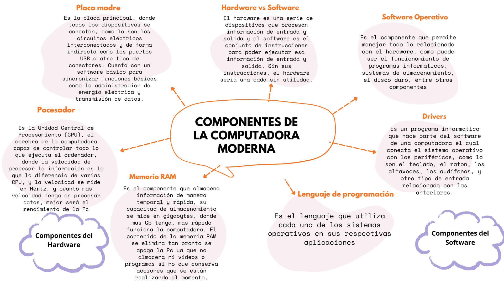

# Componentes de la computadora

### Acontinuacion veremos un mapa mental sobre los componentes de una computadora moderna, con sus respectivos componenetes tanto como del software y del hardware

# Desarrollo de preguntas

- ¿Cuál es la función principal de cada componente investigado?

#### Software
La placa madre o la placa principla es donde todos los dispositivos se conectan, como lo son los circuitos eléctricos interconectados y de forma indirecta como los puertos USB o otro tipo de conectores. 

El procesador es la Unidad Central de Procesamiento (CPU), el cerebro de la computadora capaz de controlar todo lo que ejecuta el ordenador

La memoria RAM es la Unidad Central de Procesamiento (CPU), el cerebro de la computadora capaz de controlar todo lo que ejecuta el ordenador

#### Hardware 

Software operativo es el componente que permite manejar todo lo relacionado con el hardware, como puede ser el funcionamiento de programas informáticos, sistemas de almacenamiento

Los drivers es un programa informático que hace parte del software de una computadora el cual conecta el sistema operativo con los periféricos, como lo son el teclado, el ratón entre otros.

Y el lenguaje de programacion es el lenguaje que utiliza cada uno de los sistemas operativos en sus respectivas aplicaciones.

Paquetes del software son conjuntos de programas distribuidos en un mismo set de forma complementaria.

- ¿Cómo interactúa el hardware con el software, cuál es la función de cada uno?

El hardware es una serie de dispositivos que procesan información de entrada y salida y el software es el conjunto de instrucciones para poder ejecutar esa información de entrada y salida. Sin sus instrucciones, el hardware seria una cada sin utilidad. Es el cuerpo y alma de cualquier sistema informatico, algunos ejemplos del hardware son los monitores o proyectores, teclado y raton, webcamsn, tarejtas de red, entre muchos otros y ejemplos del software es Microsoft Windows, Microsoft Word, entre otros.

- ¿Cuál es la función de la CPU y cuáles son sus partes más importantes?

La CPU es el componente principal que se encarga de procesar las señales y hace posible la computacion, actua como el cerebro de cualquier dispositivo de computacion. Obtiene instrucciones de la memoria, relaia tareas necesarias  envia la salida a la memoria. 
Sus componentes son la unidad de control, registros, y unidad de gestion de memoria.

- ¿Qué es la velocidad de la CPU, también conocida como velocidad del reloj?
La CPU se basa en una señal de relog para sincronizar sus operaciones internas. El relog genera un pulso constante a frencuencia especifica y estos ciclos de relog coordinan las operaciones de la CPU, y su velocidad se mide en hercios Hz.

- ¿Cuál es la secuencia de pasos que ocurre, desde el momento en que presionas el botón de encendido de la computadora, hasta que se muestra el sistema operativo listo para funcionar? Describe todos los elementos involucrados y el paso a paso.

Primero inicia la fuente de alimentacion, inicialmente cierra un contacto, el cual recibe como señal de arranque por parte de la placa base, la cual ordena la fuente de alimentacion que se active.
Posterior inicia el procesador el cual se encarga de comprobar que los parametros de funcionamiento son los indicados, posterior es el arranque de la placa base y arranque de la comprobacion de la memoria RAM de que todo este satisfactorio y debidamente conectado, si no, todo el proceso de detendra y inicia el arranque de todos los buses primarios y secundarios los cuales ayudan a detectar algun fallo cancelan el proceso. Tras la comprobacion de de todo este proceso, se testan los discos duros y SSD conectados a la placa base y ya finalmente se realiza el P.O.S.T, es decir ya se ha inciado y completado la fase de arrancar el ordenador.

- Comenta algo que no sabías y que descubriste en esta actividad.

No conocia nada sobre la diferencia de Hardware y software y conocer estas diferencias me resulta muy util en la vida diaria ya que se utlizan mucho estos nombres, tampoco conocia sobre el arranque del computador, y conocer los sistemas involucrados al presionar solo un boton.

[https://www.euroinnova.com/blog/que-es-el-software-y-sus-componentes-basicos](URL)

[https://aws.amazon.com/es/what-is/cpu/#:~:text=La%20CPU%20es%20el%20componente,la%20salida%20a%20la%20memoria.](URL)

[https://hardzone.es/tutoriales/montaje/arrancar-ordenador/](URL)

